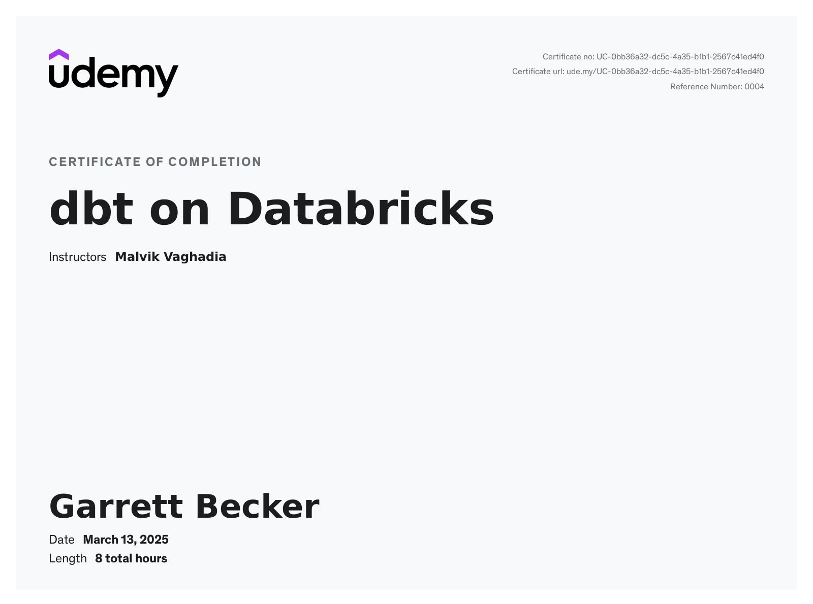

# Udemy - dbt on Databricks

Projects and learning from Malvik Vaghadia's [dbt on Databricks course on Udemy](https://www.udemy.com/course/dbt-on-databricks).

### [Certificate](https://www.udemy.com/certificate/UC-0bb36a32-dc5c-4a35-b1b1-2567c41ed4f0/)

### Course Details

#### What you'll learn
- Gain hands-on experience with dbt Cloud and dbt Core, including setup, orchestration, and deployment in real-world scenarios.
- Understand and implement dbt models, sources, and seeds within Databricks for efficient data transformations.
- Learn to use Jinja functions and macros to create dynamic, reusable SQL code in dbt projects.
- Master table materializations and incremental data loading to optimize data workflows and performance.
- Develop comprehensive testing and documentation practices to ensure data quality and project transparency in dbt.

#### Requirements
- Solid Understanding of Databricks, including Lakehouse Architecture
- Familiarity with SQL
- Knowledge of Cloud Computing (either Azure, GCP or AWS)
- Access to Cloud Platform Account (either Azure, GCP or AWS)
- Awareness of Version Control (Optional)

#### Description
Are you ready to unlock the full potential of your data analytics pipelines? dbt on Databricks is a comprehensive course tailored for data professionals aiming to master data transformation using dbt (data build tool) on the Databricks platform, harnessing the power of Apache Spark for scalable and efficient workflows.

While Databricks offers robust data processing capabilities, dbt enhances the experience by providing a framework for version-controlled, modular, and testable SQL-based transformations. This combination leverages Apache Spark's power for scalable workflows while maintaining cleaner, more maintainable, and reusable code.

The course covers both **dbt Cloud** and **dbt Core**, equipping learners with versatile skills for any environment.

**What This Course Covers:**
- Introduction to dbt and Key Concepts: Begin with an in-depth overview of dbt, Jinja templating, and YAML for configuration. Understand how these tools come together to streamline data transformation.
- Setting Up the Environment: Follow step-by-step guidance on configuring dbt Cloud with Databricks, version control essentials, and an introduction to core components and data pipelines.
- Data Modeling and Transformations: Explore multi-layer data architecture, including Bronze, Silver, and Gold models. Learn practical approaches for source referencing, schema configuration, and building efficient data pipelines using dbt commands.
- Advanced Testing and Validation: Implement robust data quality checks through generic and singular tests, transitioning from tests: syntax to data_tests:, and integrate dbt packages like dbt_utils for enhanced functionality.
- Jinja, Macros, and Custom Functions: Master the art of reusable, scalable code with Jinja syntax and macros. Gain the skills to manipulate data models dynamically, change schemas, and develop custom logic for specific use cases.
- Materializations Explained: Understand various materialization strategies including tables, views, incremental loads, and snapshots. Delve into specific scenarios like SCD Type 2 for dimension tables and incremental updates for fact tables.
- Deployment and Production Workflows: Set up a production-ready dbt environment on Databricks, manage jobs, and deploy models seamlessly. Learn to configure environment and target variables for streamlined CI/CD workflows.
- Developing with dbt Core: Experience the flexibility of dbt Core through local project setups, GitHub integration, and command-line navigation, while learning best practices for version control and collaboration.
- Troubleshooting and Advanced Techniques: Gain insights into handling common connection issues, optimizing project performance, and scaling workloads on Databricks.

**Target Audience:**
This course is designed for data engineers, analysts, and architects who are already familiar with SQL and want to elevate their skills in data transformation using dbt on the Databricks platform. Basic knowledge of Python, Git, and cloud-based data environments is recommended.

**Why Take This Course?**
With hands-on projects, guided exercises, and downloadable resources, this course builds practical skills that can be applied to real-world data challenges. By the end of the course, proficiency in building, testing, and deploying robust data pipelines will set learners apart as skilled data professionals equipped to handle complex analytics workflows.

#### Who this course is for:
- This course is for Databricks developers, data engineers, and analytics professionals who want to harness dbt for efficient data transformations and enhance their expertise in modern data workflows.